# Neutrino-Ultra - Frontend

Esta es la **aplicación frontend de Neutrino-Ultra**, desarrollada con **Next.js**, diseñada para interactuar con la API de Neutrino-Ultra y ofrecer una experiencia de usuario **moderna, fluida y segura** para una **tienda online de tecnología**.

Neutrino-Ultra es una plataforma de venta de **móviles, ordenadores, tablets y portátiles**, con gestión de stock, pedidos y roles de administración.

⚠️ **Dependencia:** Esta aplicación consume la API de Neutrino-Ultra, por lo que requiere que el backend esté funcionando.

# 📸 Capturas de pantalla

<details>
<summary><strong>📂 Mostrar / Ocultar capturas</strong></summary>

<br>

### **INICIO**
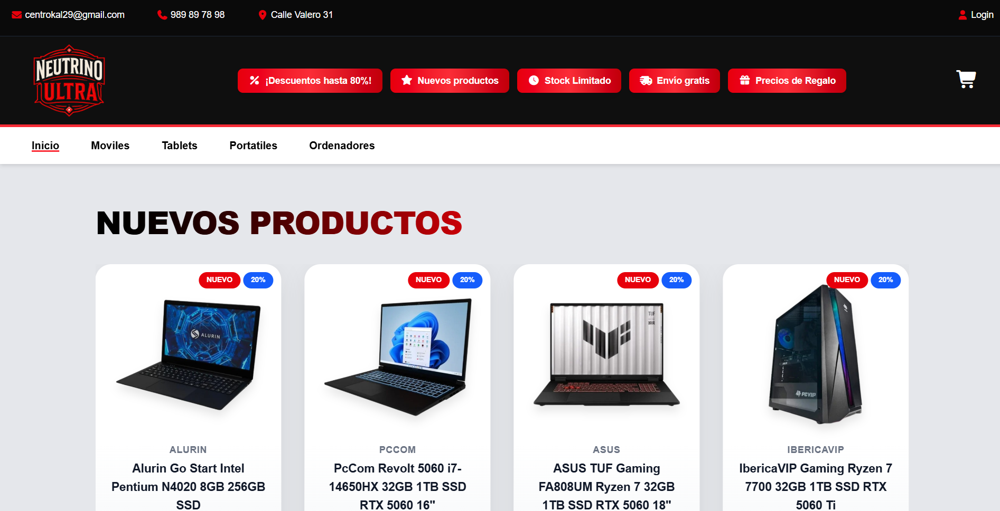

### **¿POR QUÉ COMPRAR AQUÍ?**
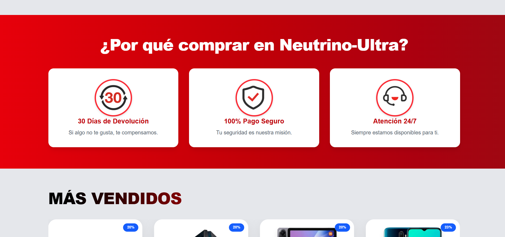

### **PRODUCTO**


### **LOGIN**
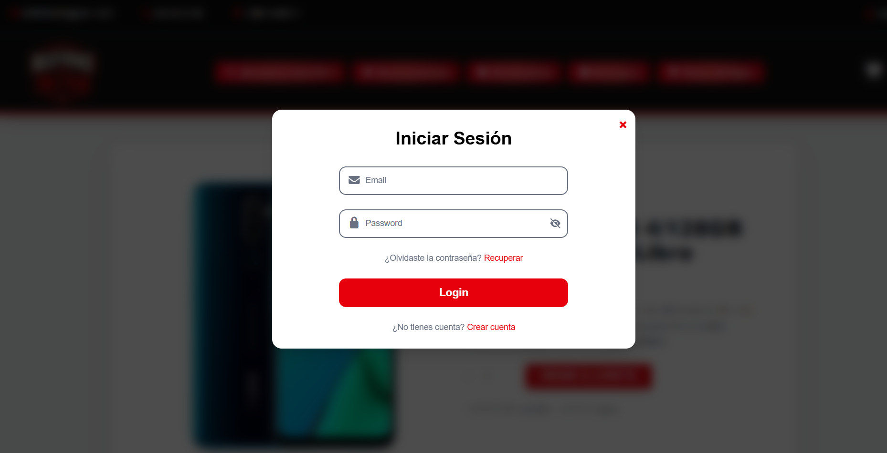

### **REGISTER**
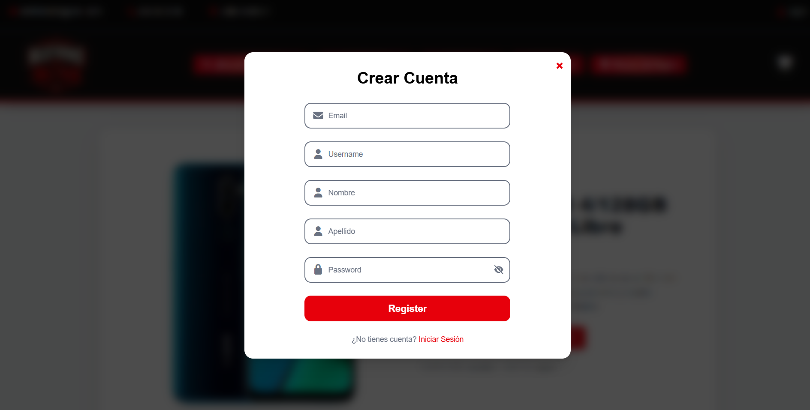

### **CARRITO**
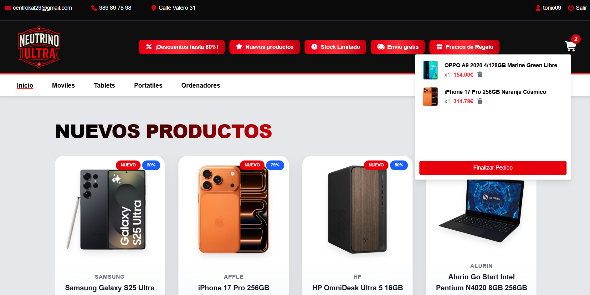

### **FINALIZAR PEDIDO**
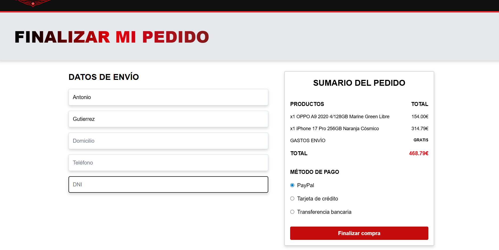

### **EDITAR PERFIL**
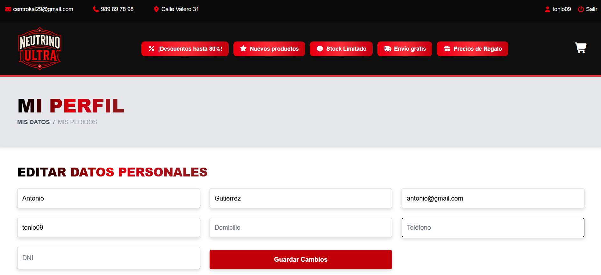

### **MIS PEDIDOS**
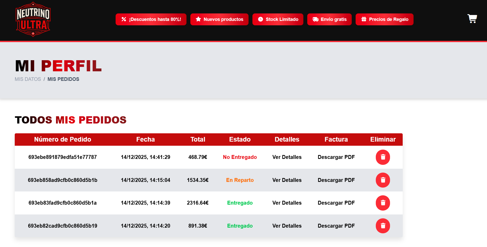

### **DETALLES DEL PEDIDO**
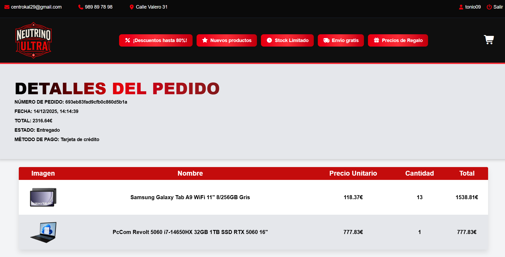

### **PANEL ADMIN, PRODUCTOS**
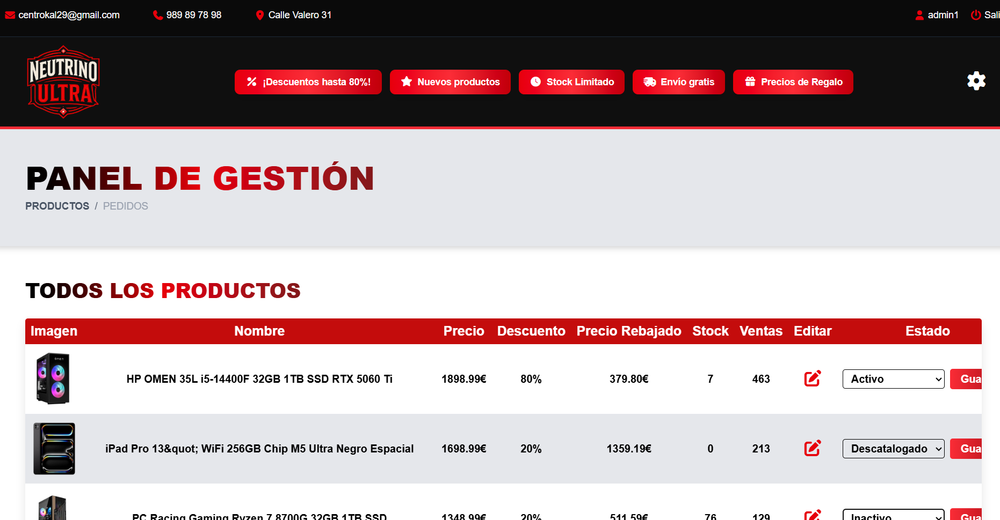

### **PANEL ADMIN, PEDIDOS**
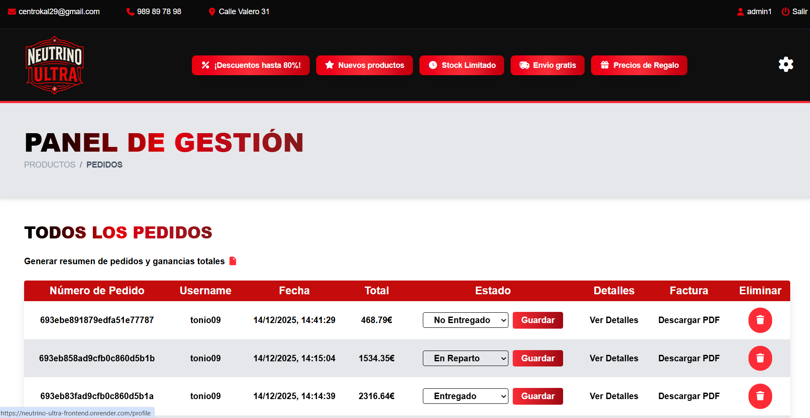

### **EDITAR PRODUCTO**
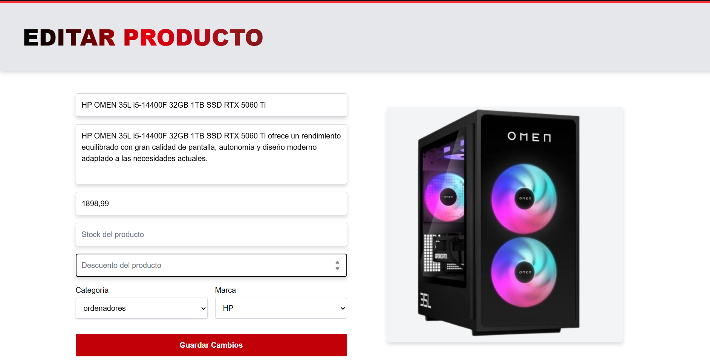

### **PANEL SUPER ADMIN, USUARIOS**
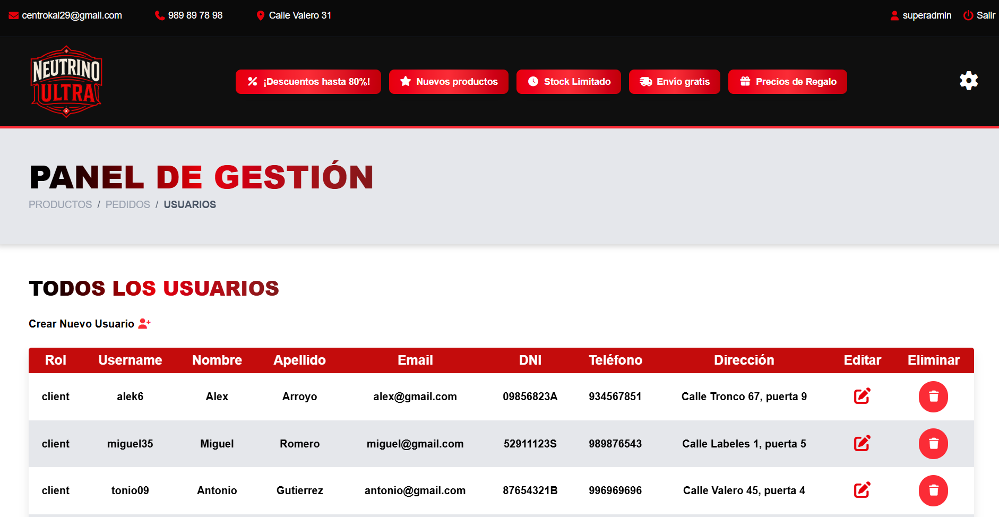

### **CREAR NUEVO USUARIO**
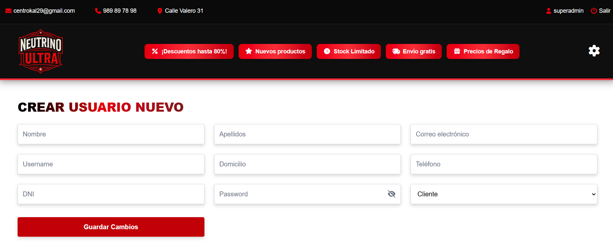


</details>

## Funcionalidades principales

### Autenticación y gestión de sesión
- Registro y login de usuarios mediante **JWT**.
- Recuperación de contraseña mediante token enviado por email.
- Persistencia de sesión usando cookies seguras.
- Control de acceso según rol del usuario.

### Gestión de perfil y pedidos
- Visualización y edición del perfil de usuario.
- Visualización del historial de pedidos.
- Descarga de **PDF con el detalle de cada pedido**.
- Consulta del estado del pedido (pendiente, en reparto, entregado).

### Productos y carrito
- Visualización del catálogo completo:
  - Móviles.
  - Ordenadores.
  - Tablets.
  - Portátiles.
- Navegación por categorías.
- Carrusel en la página de inicio con:
  - Productos más vendidos.
  - Nuevos productos.
  - Ofertas destacadas.
- Selección de cantidad según stock disponible.
- Gestión del carrito:
  - Añadir productos.
  - Eliminar productos.
  - Modificar cantidades.
- Finalización de pedido seleccionando método de envío y pago.

### Roles y panel de administración

#### Rol Admin
- Visualización y gestión de productos:
  - Editar precio.
  - Modificar stock.
  - Aplicar porcentaje de descuento.
  - Dar de baja productos.
- Visualización de todos los pedidos.
- Cambio de estado de pedidos:
  - Pendiente.
  - En reparto.
  - Entregado.
- Descarga de **PDF con el listado de pedidos y ganancias totales**.

#### Rol Super Admin
- Todas las funcionalidades del **Admin**.
- Gestión completa de usuarios:
  - Ver usuarios.
  - Crear usuarios.
  - Editar usuarios.
  - Asignar roles.
  - Visualizar pedidos de cualquier usuario.

### Consumo de API
- Uso de **fetch** para interactuar con la API.
- Manejo de respuestas y errores del servidor.
- Envío de cookies con `credentials: 'include'`.

### Routing y navegación
- Routing implementado con el sistema de rutas de **Next.js**.
- Redirecciones automáticas según el estado de autenticación y rol.
- Protección de páginas privadas y paneles de administración.

### Notificaciones y feedback
- Uso de **Sonner** para mostrar notificaciones:
  - Acciones exitosas.
  - Errores del servidor.
  - Validaciones de formularios.
- Feedback claro y directo para el usuario.

### Seguridad y buenas prácticas
- Cookies seguras para la gestión de sesión.
- Control de acceso a rutas privadas según rol.

### Variables de entorno
Crea un archivo `.env` en la raíz del proyecto y añade tus propios datos:

```bash
NEXT_PUBLIC_API_URL=
NEXT_PUBLIC_FRONTEND_URL=
```

## Tecnologías y Herramientas Utilizadas
- Next.js
- React
- Fetch API
- Sonner (notificaciones)
- Swiper (carruseles)
---

Este frontend está pensado para ser **consumido junto al backend de Neutrino-Ultra**, ofreciendo una interfaz completa y segura.


This is a [Next.js](https://nextjs.org) project bootstrapped with [`create-next-app`](https://nextjs.org/docs/app/api-reference/cli/create-next-app).

## Getting Started

First, run the development server:

```bash
npm run dev
# or
yarn dev
# or
pnpm dev
# or
bun dev
```

Open [http://localhost:3000](http://localhost:3000) with your browser to see the result.

You can start editing the page by modifying `app/page.tsx`. The page auto-updates as you edit the file.

This project uses [`next/font`](https://nextjs.org/docs/app/building-your-application/optimizing/fonts) to automatically optimize and load [Geist](https://vercel.com/font), a new font family for Vercel.

## Learn More

To learn more about Next.js, take a look at the following resources:

- [Next.js Documentation](https://nextjs.org/docs) - learn about Next.js features and API.
- [Learn Next.js](https://nextjs.org/learn) - an interactive Next.js tutorial.

You can check out [the Next.js GitHub repository](https://github.com/vercel/next.js) - your feedback and contributions are welcome!

## Deploy on Vercel

The easiest way to deploy your Next.js app is to use the [Vercel Platform](https://vercel.com/new?utm_medium=default-template&filter=next.js&utm_source=create-next-app&utm_campaign=create-next-app-readme) from the creators of Next.js.

Check out our [Next.js deployment documentation](https://nextjs.org/docs/app/building-your-application/deploying) for more details.
